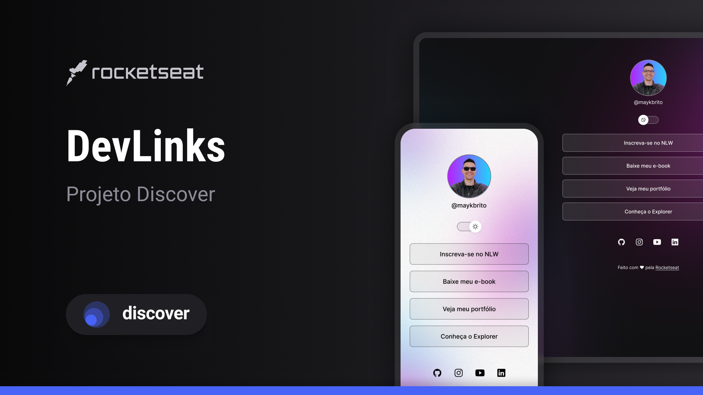

<!-- README.md - Projeto Discover -->

  

<h1 align="center">🚀 Projeto Discover - Devlinks</h1>

  Projeto desenvolvido como parte do <strong>Discover</strong>, programa de formação da Rocketseat para ensino de tecnologia WEB.

---

## 📌 Sobre o Projeto

O **Projeto Discover - DevLinks** reúne exercícios, desafios e pequenos projetos desenvolvidos durante a trilha da Rocketseat.  
O objetivo é aplicar conceitos essenciais de **HTML, CSS, JavaScript e lógica de programação**, consolidando a base para evoluir no desenvolvimento web.

---

## 🖥️ Tecnologias Utilizadas

- **HTML5**
- **CSS3**
- **JavaScript**
- **Git e GitHub**
-  **Figma**

## 📝Layout

Você pode visualizar o layout do projeto através desse [LINK] (https://www.figma.com/design/3D3wvjiVpBretrzELwt0uv/DevLinks-%E2%80%A2-Projeto-Discover--Community-?node-id=58-415&p=f&t=KxNaGnQtZyLyc3Di-0). É necessário ter conta no [Figma] (https://figma.com) para acessá-lo.

Esse projeto está sob a licença MIT.

---

Feito com ♥ by Rocketseat 
